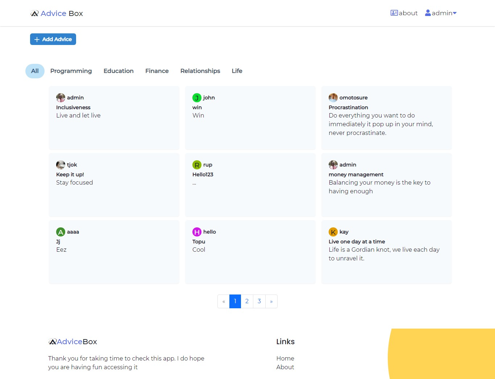

# Advice Box Mern App (Express.js / React / Redux / MongoDB)

Web app built on the MERN (MongoDB, Express, React, Node) stack of web development. It uses Redux
for the state management and Chakra UI as component library. Created with the intention of allowing
registered users drop advices under different advice categories

## Advice Box

I built this App based on the mern stack (Express.js / MongoDb / React / Redux / AntD) with generic crud and auth , admin management .

**Live App Demo** : [http://advicebox.herokuapp.com/](https://advicebox.herokuapp.com/)

## App Features :

### Backend :

- The backend is built with node.js , [express.js Framework](https://expressjs.com/), [MongoDb Database](https://www.digitalocean.com/products/managed-databases-mongodb/) and Amazon S3 for data storage
- Generic Crud Api (Create / Read / Update / Delete)
- Admin (User) Management Api
- Auth by Jwt json web token

### Frontend :

- The Frontend is built with React.js , [Chakra UI](https://chakra-ui.com/), and Redux , Redux-thunk.
- Generic Crud Component (Create / Read / Update / Delete)
- Admin (User) Management Module
- Auth Component Login / Logout
- Not Found Page
- Beautiful UI Dashboard

##  Author

Adeyemi Kolade (2021).
